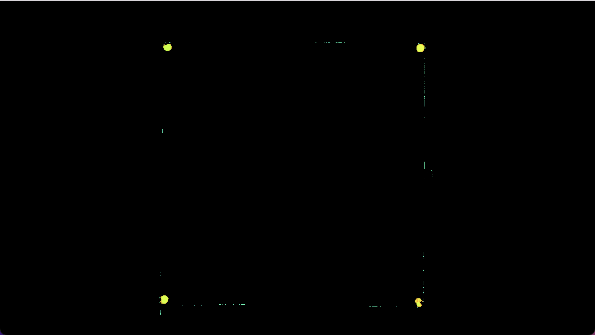
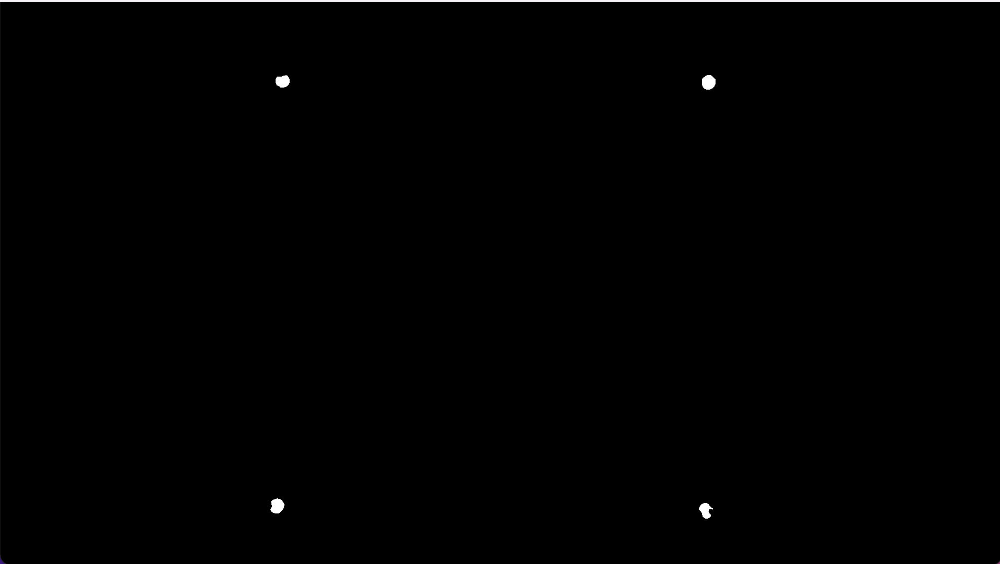
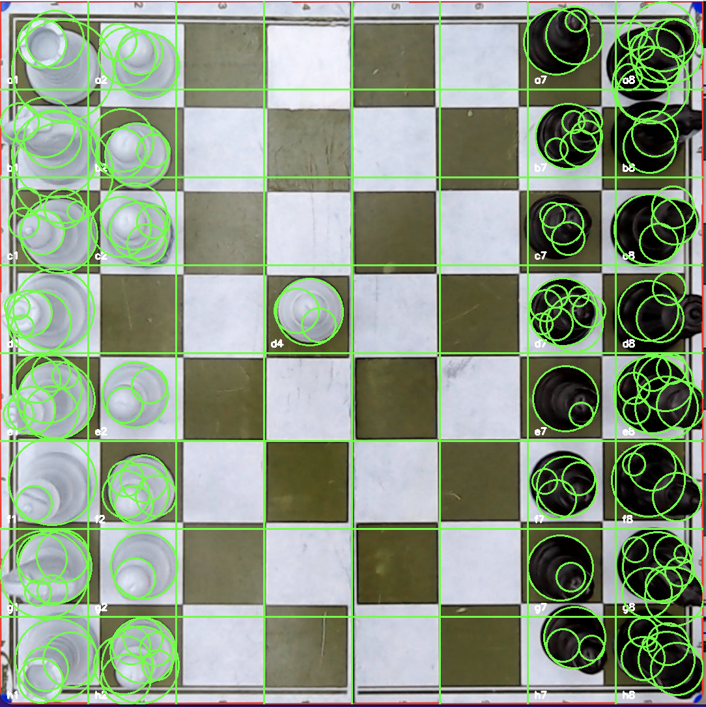

# Industrial Robotics Project – Automatic Chess Player

Students of the 7th Semester in Mechatronics Engineering at Insper, for the Industrial Robotics course.

## Introduction

As part of the seventh semester of the Mechatronics Engineering course at Insper, students engaged in the development of an ambitious and innovative project: an **Automatic Chess-Playing Robot**, created within the scope of the Industrial Robotics course. This document details the methodology adopted to design and implement the system, emphasizing the use of **computer vision** with the OpenCV library, integrated with **Python programming**.

The initial stage of the project focused on capturing and interpreting the board’s state after each opponent’s move. To achieve this, a Logitech C920e Full HD 30FPS camera was strategically positioned, allowing the robot to understand when a move was completed by detecting a button press by the opponent.

The image analysis process, responsible for identifying pieces and their positions, was divided into clear steps. OpenCV played a central role, enabling the detection of red stickers placed at the board’s corners. This detection, essential for locating the board, involved image processing techniques such as HSV color space conversion and setting thresholds for the red color.

A bounding polygon was then created from the red stickers, followed by perspective transformation techniques to produce an aligned and rectified image of the chessboard.

The document also covers the detection of empty squares and identification of piece colors — critical for interpreting opponent moves. Communication with the main control code, connected to the Stockfish chess engine, is described, demonstrating the robot’s ability to interpret board changes and respond strategically.

However, acknowledging the complexity of chess and aiming to improve the robot’s human-like behavior, the text highlights opportunities for improvement. Areas such as implementing rules like **promotion** and **en passant** are identified as possible future enhancements.

---

## Computer Vision

The use of **OpenCV** in Python was essential for advancing the project.
A **Logitech C920e Full HD 30FPS webcam** captured the board after each opponent's move. The robot knows a move is complete when the opponent presses a designated button.

The image analysis process — aimed at recognizing the opponent's move — includes the following steps:

* Import libraries
* Prepare the board
* Capture the image
* Detect the board
* Detect empty squares and piece colors
* Communicate with the main control code

All logic is wrapped inside a function (`def`) to be called from the central file.

### Board Preparation

Used libraries:

```python
import keyboard
import cv2 as cv
import numpy as np
import matplotlib.pyplot as plt
from skimage.filters import threshold_otsu
import time
import string
import os
```

Red stickers were placed on the corners of the chessboard to aid webcam detection.

### Image Capture

Image capture was done by referencing the correct webcam port and defining custom parameters to optimize image quality and processing:

```python
cam_port = 0
cam = cv.VideoCapture(cam_port, cv.CAP_DSHOW)

cam.set(cv.CAP_PROP_FRAME_WIDTH, 1920)
cam.set(cv.CAP_PROP_FRAME_HEIGHT, 1080)
cam.set(cv.CAP_PROP_BRIGHTNESS, 128)
cam.set(cv.CAP_PROP_CONTRAST, 128)
cam.set(cv.CAP_PROP_SATURATION, 120)
cam.set(cv.CAP_PROP_EXPOSURE, -5)
```

Captured image: 

### Board Detection

The raw image is transformed to **HSV color space** to detect red markers (ensure no other red objects are in the environment):

```python
lower1 = np.array([0, 120, 150])
upper1 = np.array([10, 255, 255])

lower2 = np.array([160,200,20])
upper2 = np.array([179,255,255])
```

Color detection result: 

Image is cleaned using erosion, dilation, and blurring to isolate the red stickers:

```python
kernel = cv.getStructuringElement(cv.MORPH_RECT, (2, 2))
clean = cv.morphologyEx(full_mask, cv.MORPH_OPEN, kernel)
clean = cv.medianBlur(clean,5)
```

Cleaned image in grayscale: 

Circle centers are detected using HoughCircles:

```python
circles = cv.HoughCircles(img, cv.HOUGH_GRADIENT, dp=1, minDist=200, param1=3, param2=5, minRadius=0, maxRadius=20)
```

Each circle is assigned to a quadrant:

* `top_right`, `top_left`, `bottom_left`, `bottom_right`

Circle detection result: 

Quadrant visualization: 

A polygon is drawn between the four points to isolate the board:

```python
square = cv.polylines(board, [pts], isClosed, color, thickness)
mask = np.zeros_like(board)
cv.fillPoly(mask, [pts], (255, 255, 255))
result = cv.bitwise_and(board, mask)
```

Then the board is warped using perspective transformation to align it properly:

```python
input_pts = np.float32([[top_left[0], top_left[1]],
                        [bottom_left[0], bottom_left[1]],
                        [bottom_right[0], bottom_right[1]],
                        [top_right[0], top_right[1]]])

output_pts = np.float32([[0, 0], [0, height],
                        [width, height], [width, 0]])

M = cv.getPerspectiveTransform(input_pts, output_pts)
out = cv.warpPerspective(img_copy, M, (img_copy.shape[1], img_copy.shape[0]), flags=cv.INTER_LINEAR)
```

Final transformed image: 

---

### Detection of Empty Squares and Piece Colors

To determine the opponent’s move, the program checks for empty squares and piece colors.
The board is split into an **8×8 grid**, and each block is labeled like a real chessboard (`a1`, `b1`, etc.).

To detect a piece in a square, `HoughCircles` is used again:

```python
circles = cv.HoughCircles(gray, cv.HOUGH_GRADIENT, dp=1, minDist=20, param1=50, param2=30, minRadius=0, maxRadius=0)
```

Result: 

To detect the color of the piece, the program calculates grayscale intensity in the region around the circle’s center:

```python
grayscale_intensity = 0.299 * avg_color[2] + 0.587 * avg_color[1] + 0.114 * avg_color[0]
color_category = "white" if grayscale_intensity > 128 else "black"
```

---

### Communication with Central Code

The central code, connected to the **Stockfish engine**, calls the vision function (wrapped in `def`) and passes:

* List of previous empty blocks
* Dictionary of occupied blocks and their colors

The function returns:

* New list of empty blocks
* String with detected move (e.g., `"d2d4"`)
* Updated dictionary of occupied blocks

Example:

```python
jogada_anterior = ['d3', 'd4', ...]
jogada_seguinte = ['d2', 'd4', ...]
```

Detected move:

```python
'd2d4'
```

This string is sent to **Stockfish**, which uses **reinforcement learning** to determine the best response. That move is then translated into coordinates, converted to millimeters, and sent via **Modbus** to the **UR robot**.

Once all values are transmitted, Python sends a signal to the robot to begin moving. After the movement is complete, the robot returns a signal confirming completion.

Then the chess system resets the inputs and waits for the opponent to make a move and press the button again.

---

## Project Improvements

To make the robot a more realistic chess player, some improvements could be made, such as:

* Implementing **“promotion”** detection
* Implementing **“en passant”** logic

These features are currently not included and are proposed for future development.

---

Let me know if you want this in a nicely formatted GitHub `README.md` version too!
